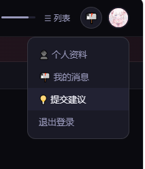
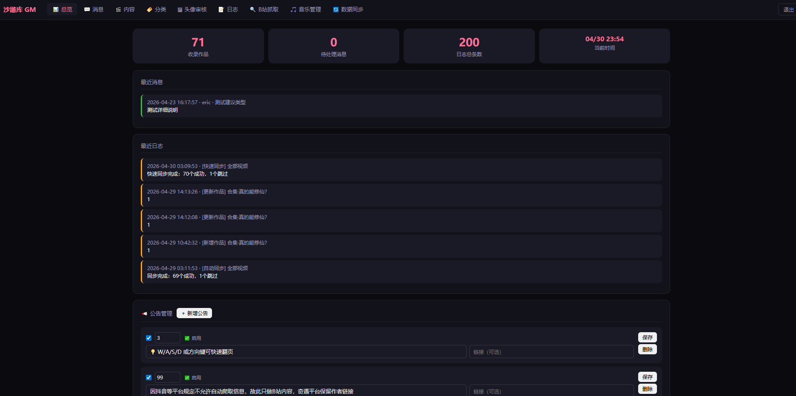
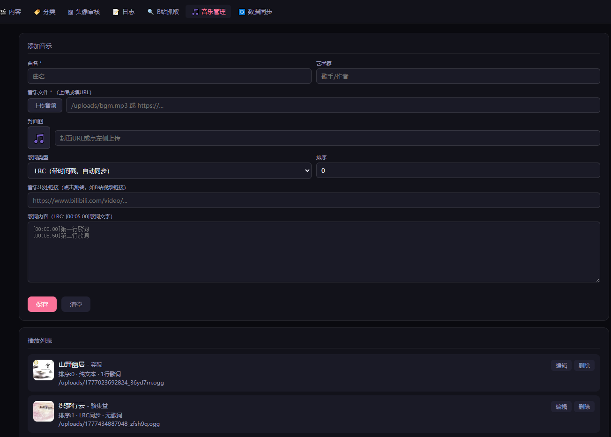

#本来是想试试ai自动建站做成沙雕动画维权站点的，
#但是一想到观众大多只在意作品能不能免费看，
#而且沙雕动画的小说版权方也可能会顺着摸过来勒令下架，就给做一半放下了，
#全部内容都打包放进来了，除了资源文件别的都放进来了，
#虽然没什么价值，希望有大佬想到破局的方法，所以把沙雕库开源出来了
#部署命令在sukura/deploy.sh
#请大佬们品鉴，claude pro 约12个小时跑出来的，纯ai生成，没看过源码，

<h2>项目展示</h2>

<strong>用户页主页：</strong>展示用户访问后的主页界面。

<strong>任选作品点入主页：</strong>从作品列表中选择任意作品后进入对应主页。

<strong>合集的子集页面：</strong>展示合集下的子集内容页面。

<strong>基础功能：</strong>展示系统的基础功能入口和操作区域。

<strong>GM 主页：</strong>展示管理员或 GM 后台主页。

<strong>消息回复：</strong>展示消息查看与回复功能。

<strong>内容页：</strong>展示内容详情页的整体布局。

<strong>内容页子集管理：</strong>展示内容页中的子集管理功能。

<strong>内容页子集管理音频管理页：</strong>展示子集下的音频管理页面。

<strong>内容页编辑：</strong>展示内容页的编辑界面。

<strong>自动爬取信息并填充：</strong>展示输入信息后自动抓取并填充内容的功能。

<strong>自定义分类：</strong>展示自定义分类管理功能。

<strong>用户头像更新审核：</strong>展示用户头像更新后的审核流程。

<strong>日志页：</strong>展示系统日志记录页面。

<strong>B站搜索抓取：</strong>展示通过 B 站搜索并抓取信息的功能。

<strong>用户页站点音乐管理：</strong>展示用户页中的站点音乐管理功能。

<strong>主体的内容管理页：</strong>展示主要内容管理后台页面。

<strong>输入 UP 主页一键导入：</strong>展示输入 UP 主主页后自动导入信息的功能。

#!/bin/bash
# 沙雕库部署脚本
# 在 /var/www/sukura 目录下执行

set -e
echo "=== 沙雕库部署开始 ==="

# 1. 安装依赖
echo "[1/4] 安装 npm 依赖..."
npm install --production

# 2. 创建数据目录
echo "[2/4] 创建数据目录..."
mkdir -p data

# 3. 安装 pm2（进程守护）
echo "[3/4] 安装 PM2..."
npm install -g pm2 2>/dev/null || true

# 4. 启动服务
echo "[4/4] 启动服务..."
pm2 delete sukura 2>/dev/null || true
pm2 start server.js --name sukura
pm2 save
pm2 startup | tail -1 | bash 2>/dev/null || true

echo ""
echo "=== 部署完成 ==="
echo "服务运行在: http://localhost:3000"
echo "查看日志: pm2 logs sukura"
echo "重启服务: pm2 restart sukura"
echo ""
echo "接下来配置 nginx 反代（见 nginx.conf.example）"
